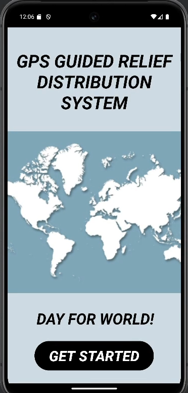
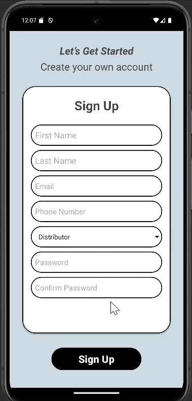
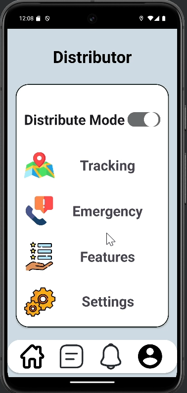
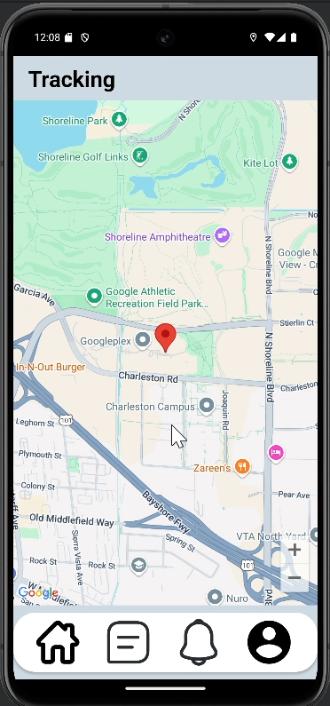
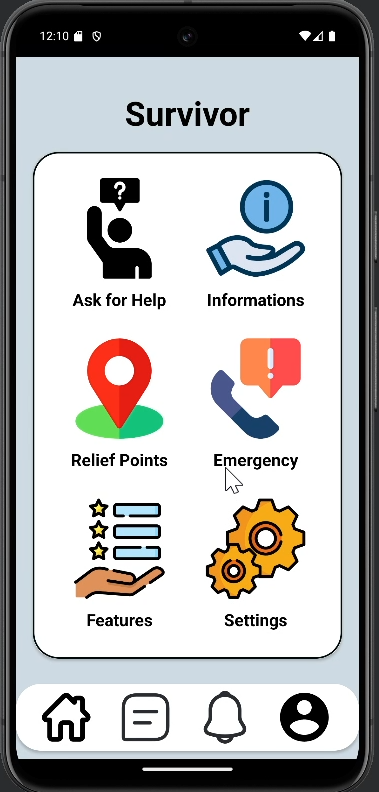
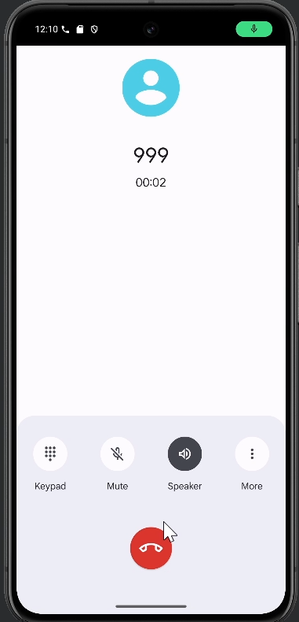

# 🌍 GPS Guided Relief Distribution System

<p align="center">
  <strong>An Android application for fair, transparent, and GPS-based disaster relief distribution.</strong>
</p>

<p align="center">
  
  
  
  
</p>

---

## 📖 Overview

Natural disasters often create significant challenges in distributing relief fairly and efficiently. The **GPS Guided Relief Distribution System** is an Android application designed to improve coordination between relief distributors and disaster-affected people using real-time GPS tracking and location-based services.

The application enables distributors to track each other's locations, locate affected areas, and communicate more effectively while ensuring relief reaches the people who need it most.

---

## ✨ Features

### 👨‍💼 Distributor

- User Registration & Login
- GPS-based Live Location Tracking
- View Distribution Area on Google Maps
- Enable/Disable Distribution Mode
- Emergency Call (999)
- Manage Relief Distribution
- Notifications
- Settings

### 🧑 Survivor

- Create Account
- Request Help
- View Nearby Relief Points
- Emergency Call
- Disaster Information
- Application Features
- Settings

---

## 🛠️ Technology Stack

| Category | Technology |
|----------|------------|
| Language | Java |
| IDE | Android Studio |
| Database | Firebase Realtime Database |
| Authentication | Firebase Authentication |
| Maps | Google Maps API |
| Location | Fused Location Provider |
| Backend | Firebase |
| UI | XML |

---

## 📱 Application Screens

| Splash Screen | Registration |
|:--------------:|:------------:|
|  |  |

| Distributor Dashboard | Live Tracking |
|:----------------------:|:-------------:|
|  |  |

| Survivor Dashboard | Emergency Call |
|:------------------:|:--------------:|
|  |  |

> **Note:** Place the screenshots inside a `screenshots/` folder and update the filenames if necessary.

---

## 📂 Project Structure

```
Relief_Distribution_App/
│
├── app/
├── gradle/
├── screenshots/
├── .gitignore
├── build.gradle
├── settings.gradle
└── README.md
```

---

## 🚀 Installation

### Clone the repository

```bash
git clone https://github.com/MehediNoorNeo/Relief_Distribution_App.git
```

### Open the project

- Open Android Studio
- Select **Open Existing Project**
- Choose the cloned folder

### Configure Firebase

- Create a Firebase project.
- Enable **Authentication**.
- Enable **Realtime Database**.
- Download **google-services.json**.
- Place it inside:

```
app/google-services.json
```

### Configure Google Maps API

Add your Google Maps API key inside:

```xml
<meta-data
    android:name="com.google.android.geo.API_KEY"
    android:value="YOUR_API_KEY"/>
```

### Run the application

Connect an Android device or emulator and click **Run**.

---

## 🔐 Permissions

The application requires:

- Internet
- Fine Location
- Coarse Location
- Call Phone
- Network State

---

## 📌 Future Improvements

- Push Notifications
- Chat Between Distributor and Survivor
- Offline Map Support
- AI-based Relief Demand Prediction
- Image Upload
- Route Optimization
- Disaster Analytics Dashboard

---

## 🎯 Research Objective

The goal of this project is to improve disaster response by:

- Ensuring fair relief distribution
- Tracking relief distributors in real time
- Reducing duplicate distribution
- Helping affected people quickly locate relief points
- Improving coordination among volunteers

---

## 👨‍💻 Developer

**Mehedi Hasan**

- GitHub: https://github.com/MehediNoorNeo

---

## 📄 License

This project is intended for educational and research purposes.